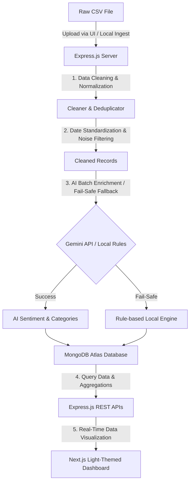

# QuickCart Customer Feedback Intelligence System

A high-performance pipeline and dashboard designed to clean, analyze, and visualize customer feedback for QuickCart (a food and grocery delivery app). It processes messy raw CSV inputs, standardizes fields, performs AI-driven sentiment analysis, categorizes user complaints, and presents results in a premium, light-themed analytics dashboard.

---

## 🛠️ Tech Stack

### Frontend
- **Framework**: Next.js 15 (React 19)
- **Styling**: Vanilla CSS (Harmonious Grey-Blue Light Palette, Glassmorphism, Micro-animations)
- **Data Visualization**: Recharts (Responsive Line, Pie, and Bar Charts)
- **Deployment**: Vercel-ready

### Backend
- **Runtime**: Node.js (ES Modules)
- **Framework**: Express.js
- **Database**: MongoDB Atlas (Mongoose ODM)
- **AI Engine**: Google Gemini API (`gemini-1.5-flash` with dynamic local rule-based fallback)
- **Ingestion**: Multer (File uploads), CSV-Parser

---

## 🏗️ System Architecture



---

## 🔄 Core Ingestion Flow

1. **Upload / Trigger Ingest**: Users select a CSV file in the Next.js UI or run the local ingestion script.
2. **Standardization & Deduplication**:
   - Inconsistent date formats are parsed and normalized to standard ISO timestamps.
   - Meaningless text (e.g., repeating punctuation like `????`, emojis, or test records) is stripped.
   - Support agent signatures and order IDs (e.g., `Agent Priya...`, `order #12345`) are cleaned out.
   - Exact duplicate row IDs and feedback text are removed.
3. **AI & Rule-Based Fallback Analysis**:
   - Cleansed data is sent in batches to the Google Gemini API to analyze sentiment (positive, negative, neutral), classify categories (Billing, App Bug, Delivery, Staff/Support, Other), detect sarcasm, and summarize the core issue.
   - **Fail-Safe**: If Gemini throws a connection or quota error, the system instantly switches to a highly optimized local rule-based matcher to classify the remainder of the dataset without stalling.
4. **Storage & Dashboard**:
   - Records are persisted into MongoDB Atlas with configured indexes on category, sentiment, and timestamp.
   - Next.js fetches structured metrics and lists to build dynamic charts, sarcasm callouts, trends, and search/filters.

---

## 🚀 How to Run Locally

### Backend
1. Navigate to `/backend`:
   ```bash
   cd backend
   ```
2. Configure `.env` variables:
   ```env
   PORT=5050
   MONGODB_URI=your_mongodb_connection_string
   GEMINI_API_KEY=your_gemini_api_key
   ```
3. Install and run:
   ```bash
   npm install
   npm start
   ```

### Frontend
1. Navigate to `/frontend`:
   ```bash
   cd frontend
   ```
2. Install and run (using Webpack mode on Windows to avoid native binary issues):
   ```bash
   npm install
   next dev --webpack
   ```
3. Open [http://localhost:3000](http://localhost:3000) in your browser.
